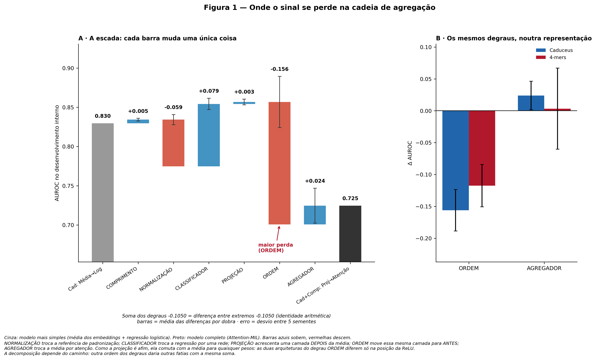
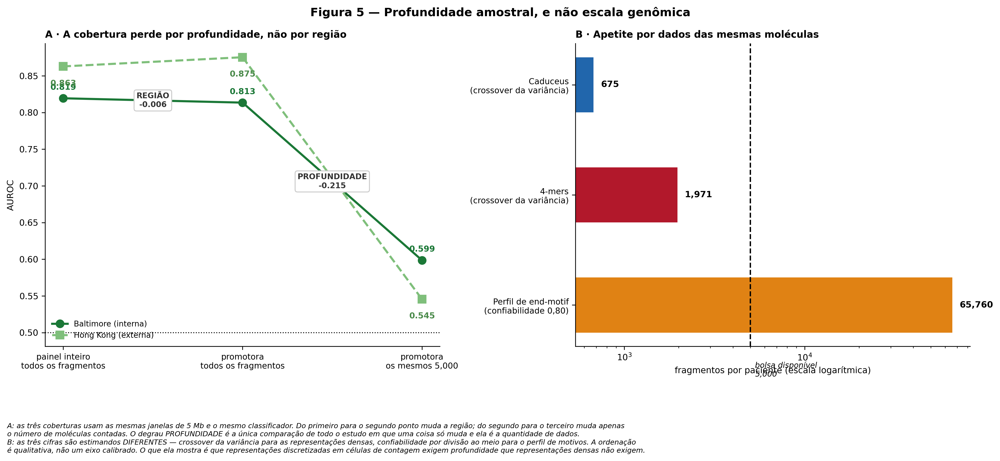
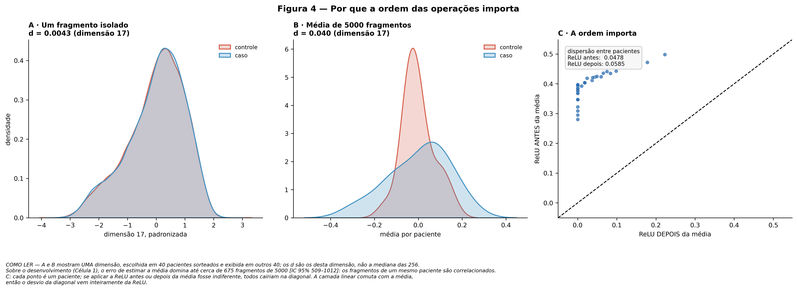
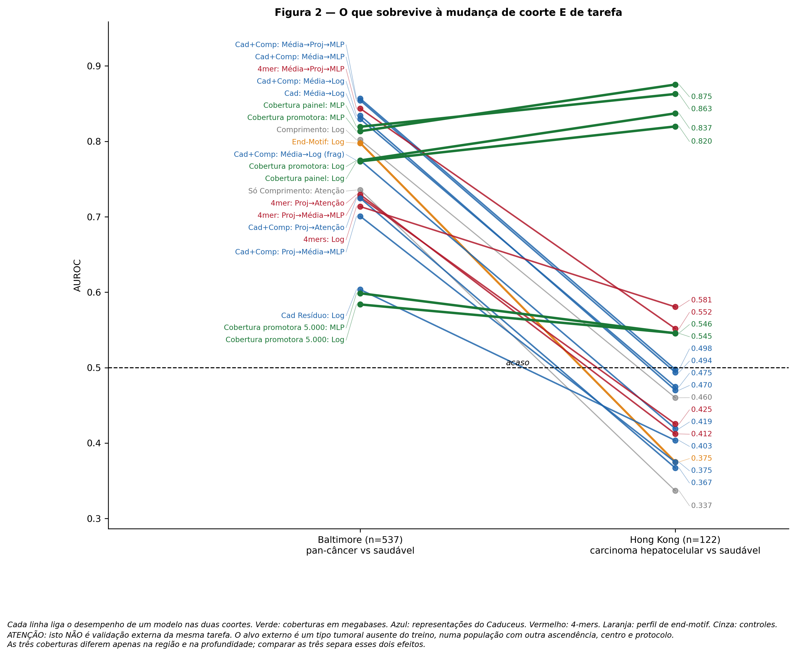
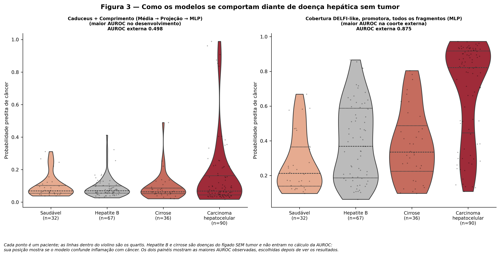
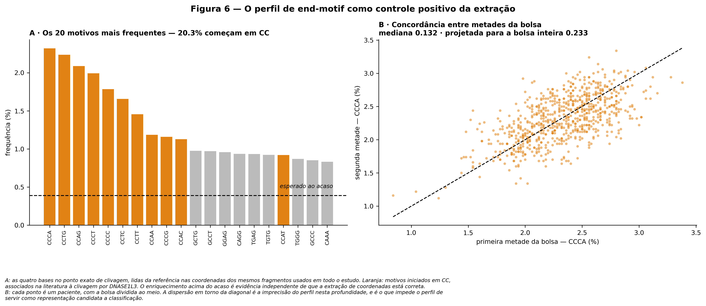

# Benchmark decomposto de Deep Learning em fragmentômica de cfDNA

Este repositório contém um detector de câncer construído a partir de DNA livre
circulante com um *Foundation Model* genômico e uma rede com atenção, e a
decomposição desse detector peça por peça.

A decomposição mostrou que duas decisões dominam o desempenho, e que nenhuma
delas diz respeito ao *encoder* nem ao classificador. A primeira é **onde a não
linearidade é aplicada** em relação à média das moléculas. A segunda é **quantas
moléculas cada representação recebe**.

Tudo aqui é reproduzível a partir de dados públicos. O download e o recorte
rodam numa máquina local com `bedtools` e `tabix`; a extração de features e o
benchmark rodam numa GPU gratuita do Kaggle. O benchmark completo leva 38,5
minutos.

---

## O problema

Células que morrem liberam o seu DNA na corrente sanguínea. Esse material é o
**cfDNA**. Quando há um tumor, uma fração dos fragmentos veio dele. Em doença
inicial, menos de um por cento.

Existem duas formas de procurar essa fração. A primeira é ler as bases e caçar
mutações, o que exige sequenciamento profundo e falha quando o tumor não carrega
nenhuma das mutações do painel. A segunda é medir a **forma** das moléculas:
fragmentos tumorais são em média mais curtos, terminam em posições diferentes e
distribuem-se de maneira desigual pelos cromossomos.

O método de referência dessa segunda via chama-se **DELFI** (Cristiano et al.,
2019). Ele divide o genoma em janelas de cinco milhões de bases e conta, em cada
janela, quantos fragmentos são curtos e quantos são longos. Não exige leitura
profunda, e foi validado numa coorte independente de câncer de pulmão.

Recentemente passou-se a aplicar duas ferramentas novas ao mesmo problema: um
**Foundation Model** genômico, que representa qualquer trecho de sequência como
um vetor de 256 números, e o **Attention-MIL**, que recebe todas as moléculas de
um paciente e aprende um peso para cada uma.

A combinação apoia-se em três premissas que raramente são testadas:

1. o *encoder* retém sinal biológico em cada molécula individualmente;
2. a atenção identifica as moléculas de origem tumoral;
3. usar apenas coordenadas, sem o genótipo do paciente, impede o modelo de
   aprender estrutura populacional.

Este trabalho testa as três, e mede quanto cada decisão de engenharia contribui.

---

## Aquisição e preparo dos dados

Esta é a única etapa que não roda no Kaggle. Ela exige uma máquina com disco,
`bedtools` e `htslib` (`tabix`, `bgzip`).

```
FinaleDB (AWS S3)  ~280 GB, alinhamentos hg38
        │
        │  scripts/finaledb_aws_source.txt
        │  endereços de origem dos dois estudos usados
        ▼
/mnt/.../estudos/<estudo>/<condicao>/*.frag.tsv.bgz + .tbi
        │
        │  scripts/recorta_painel.sh
        │  recorte para o painel de promotores
        ▼
/mnt/.../estudos_recortados/  ~12 GB   (redução de cerca de 23×)
        │
        │  scripts/upload_to_kaggle_dataset.sh
        ▼
Kaggle Datasets  →  entrada dos notebooks
```

**1. Download.** O arquivo `scripts/finaledb_aws_source.txt` registra os
endereços de origem no FinaleDB. Baixamos apenas os arquivos alinhados contra
hg38, dos dois estudos usados. Cada arquivo lista as moléculas de um paciente,
uma por linha, com cromossomo, posição inicial, posição final, qualidade de
mapeamento e fita. **Não há sequência, apenas coordenadas.** O genótipo do
paciente nunca entra no estudo: as bases são lidas do genoma de referência nas
coordenadas do fragmento.

**2. Recorte.** O `recorta_painel.sh` reduz o volume restringindo os arquivos às
vizinhanças de promotores, que são regiões de cromatina aberta com posicionamento
característico de nucleossomos.

O script começa construindo o painel a partir de dois arquivos de referência:
`GRCh38-PLS.bed`, com os promotores, e `ENCFF356LFX.bed`, a lista de exclusão do
ENCODE. Cada promotor autossômico é expandido ±2 kb em torno do centro,
intervalos separados por menos de 500 pb são fundidos, as regiões de exclusão
são subtraídas, e o resultado é **refundido**.

Essa refusão não é cosmética. Ao subtrair a lista de exclusão, um intervalo do
painel pode ser dividido em dois trechos separados por uma faixa estreita. Se
essa faixa for menor que o comprimento máximo de fragmento, a mesma molécula
intersecta os dois trechos e o `tabix -R` a emite **duas vezes**, criando uma
duplicata que nada acusa. O script refunde os trechos e verifica, com um teste
bloqueante, que nenhum par de intervalos ficou a distância inferior a 300 pb.
Se a invariante falhar, a execução para.

Duas outras salvaguardas estão no início do script. `LC_ALL=C` é obrigatório,
porque a ordenação de arquivos BED depende do locale e, sob `pt_BR.UTF-8`, a
colação pode produzir um índice `tabix` inconsistente sem emitir erro. E o
`tabix` disponível precisa suportar `-R`, o que é verificado antes de qualquer
processamento.

O recorte propriamente dito é `tabix -R painel | sort | bgzip`, seguido de
reindexação, com verificação de integridade em cada arquivo produzido. A
execução é paralela e retomável: arquivos já prontos e com índice válido são
pulados.

```bash
# simulação, não escreve nada
./scripts/recorta_painel.sh

# execução com 24 processos
./scripts/recorta_painel.sh --apply -j 24

# auditar uma saída já existente
./scripts/recorta_painel.sh --verificar
```

Ao terminar, o script imprime um relatório com o volume antes e depois, a
contagem de arquivos por estudo conferida contra a tabela suplementar do
FinaleDB, e uma auditoria de integridade de todos os índices. Imprime também o
**md5 do painel**, que os notebooks conferem antes de processar qualquer coisa.

**3. Upload.** O `upload_to_kaggle_dataset.sh` empacota a saída recortada e a
publica como conjuntos de dados do Kaggle, preservando a organização
`estudo/condicao/` e acompanhando o `manifest.csv` que os notebooks consomem
(`sample_id`, `estudo`, `condicao`).

Conjuntos de dados resultantes, todos públicos:

- [`cfdna-cristiano2019-delfi`](https://www.kaggle.com/datasets/fredericoflores1807/cfdna-cristiano2019-delfi) — coorte de Baltimore, recortada
- [`cfdna-jiang2015-hcc`](https://www.kaggle.com/datasets/fredericoflores1807/cfdna-jiang2015-hcc) — coorte de Hong Kong, recortada
- [`cfdna-ref-hg38`](https://www.kaggle.com/datasets/fredericoflores1807/cfdna-ref-hg38) — `hg38.2bit`, `GRCh38-PLS.bed` e `painel_ext.bed`
- [`cfdna-promoter-multimodal-resume-v3`](https://www.kaggle.com/datasets/fredericoflores1807/cfdna-promoter-multimodal-resume-v3) — features extraídas, entrada do benchmark

---

## As coortes

| Coorte | Estudo | n | Composição | Papel |
| :--- | :--- | ---: | :--- | :--- |
| Baltimore | Cristiano et al., 2019 | 537 | 276 casos de oito tipos tumorais, sem câncer de fígado, e 261 saudáveis | Desenvolvimento |
| Hong Kong | Jiang et al., 2015 | 225 | 90 carcinomas hepatocelulares, 32 saudáveis, 67 hepatites B, 36 cirroses | Avaliação externa, aberta só no fim |

Cada paciente é representado por **5.000 moléculas**, sorteadas uniformemente
por amostragem de reservatório entre as elegíveis. São elegíveis as que têm
qualidade de mapeamento mínima de 30, comprimento entre 100 e 220 pb, e ponto
médio dentro do painel e a até 1 kb do centro de um promotor.

Esse número de 5.000 decorre do custo de passar cada molécula pelo *Foundation
Model*. Ele reaparece, mais adiante, como causa do segundo achado.

---

## O regime: nenhuma molécula decide sozinha

Antes de qualquer modelo, medimos quanta informação existe.

Uma molécula isolada separa doentes de saudáveis por cerca de **um centésimo**
de desvio padrão. A média das 5.000 moléculas do paciente separa por **dois
décimos**, vinte vezes mais.

A média é o operador que torna o sinal mensurável. Tudo o que vem depois depende
de como esse operador é tratado.

---

## Primeiro experimento: a escada da arquitetura

Montamos seis modelos intermediários entre o mais simples e o mais complexo.
Cada degrau altera **um único elemento**. A soma dos seis iguala a diferença
entre os extremos, o que verifica a aritmética.

O experimento inteiro foi repetido cinco vezes com partições e inicializações
independentes, dando 25 comparações por degrau.



| Degrau | O que muda | Efeito | Negativo em |
| :--- | :--- | ---: | ---: |
| COMPRIMENTO | acrescenta o comprimento da molécula | +0,005 | 1 de 25 |
| NORMALIZAÇÃO | altera a referência de padronização | −0,059 | 22 de 25 |
| CLASSIFICADOR | regressão logística substituída por rede | +0,079 | 0 de 25 |
| PROJEÇÃO | projeção acrescentada **depois** da média | +0,003 | 10 de 25 |
| **ORDEM** | mesma projeção movida para **antes** da média | **−0,156** | **25 de 25** |
| AGREGADOR | média substituída por atenção | +0,024 | 10 de 25 |

O degrau **ORDEM** tem a maior magnitude e é o único negativo em todas as
comparações. Ele não acrescenta nem remove componente algum: move uma operação
de lugar.

Duas verificações. Restrito às execuções que atingiram a triagem de desempenho
mínimo, o degrau permanece e permanece negativo em todas. Medido sobre uma
contagem elementar de 4-mers em vez do *Foundation Model*, vale −0,117, negativo
em 24 de 25. **O efeito não é propriedade do encoder.**

Há também uma perda de reprodutibilidade. Antes do degrau, as cinco repetições
ordenam os pacientes com concordância de **0,93**. Depois, **0,20**. Das 17
falhas de treinamento observadas entre braços que processam moléculas
individualmente, todas as 17 estão do lado em que a não linearidade precede a
média, e nenhuma do lado oposto.

---

## Segundo experimento: a escada da cobertura

A rede neural observa 5.000 moléculas. A cobertura DELFI-*like* observa todas.
Comparar as duas confunde a escala genômica com o número de moléculas.

Calculamos a cobertura em três versões para separar os dois fatores. Entre a
primeira e a segunda muda a **região**. Entre a segunda e a terceira muda apenas
a **profundidade**: mesmas janelas, mesmo classificador, mesmas partições, menos
moléculas contadas.



| Degrau | O que muda | Interno | Externo | Negativo em |
| :--- | :--- | ---: | ---: | ---: |
| REGIÃO | janelas restritas a regiões promotoras | −0,006 | +0,013 | 14 de 25 |
| **PROFUNDIDADE** | mesmas 5.000 moléculas da bolsa | **−0,215** | **−0,330** | **25 de 25** |

Restringir a região não produz efeito distinguível de zero. Restringir a
profundidade é negativo em todas as 25 comparações, nas duas famílias de
classificador, e pior ainda na coorte externa.

A aritmética é direta. São 566 janelas utilizáveis; com 5.000 moléculas, cada
janela recebe menos de nove, ainda divididas entre curtas e longas. Uma razão
entre contagens dessa ordem é ruído de amostragem. Com todas as moléculas
disponíveis, cada janela recebe cerca de mil.

**A vantagem da cobertura DELFI-like decorre do número de moléculas observadas,
e não da escala genômica.**

---

## Por que as duas perdas têm a mesma origem



A projeção que muda de posição contém uma transformação afim e uma função ReLU,
que substitui por zero todos os valores negativos.

A transformação afim comuta com a média: aplicá-la a cada molécula e depois
tirar a média dá o mesmo resultado que tirar a média e depois aplicá-la. A
identidade foi verificada numericamente, com erro máximo de 2,98 × 10⁻⁸. A
diferença entre as duas arquiteturas do degrau ORDEM é, portanto, **apenas a
posição da ReLU**.

A ReLU não comuta. Com sinal por molécula da ordem de um centésimo de desvio
padrão, o conteúdo de cada molécula é majoritariamente variação simétrica, que a
média cancela. A ReLU elimina um dos lados da distribuição e desloca o resultado
antes que o cancelamento ocorra.

O segundo achado tem a mesma estrutura. Nove moléculas por janela não dão à
média material suficiente para cancelar coisa alguma.

Em ambos os casos o que determina o resultado é **quando** a operação é aplicada
e **sobre quanto** a média opera.

---

## As três premissas

**O encoder.** Reconstruímos o vetor de 256 números do Caduceus a partir de duas
descrições elementares: a frequência de 4-mers na mesma janela e o promotor
atingido. A reconstrução explica **99% da variação**. A parcela não reconstruída
discrimina casos de controles acima da distribuição nula empírica, e o vetor
completo supera a contagem de 4-mers em cerca de dez pontos de AUROC.

**A atenção.** Sob peso uniforme, o número efetivo de instâncias seria 5.000. O
valor observado é **4.782**, ou 95,6% da bolsa. A atenção não seleciona
moléculas; calcula uma média com pesos ligeiramente desiguais.

**A ausência de genótipo.** Usando **apenas indivíduos saudáveis** das duas
coortes, e trocando o rótulo de doença pelo rótulo de centro, uma única
componente principal da cobertura separa Baltimore de Hong Kong. Duas
componentes do embedding do Caduceus atingem 0,99.

Nenhuma das três se sustentou nas condições avaliadas.

---

## Transferência entre coortes

A coorte externa difere da interna em três aspectos ao mesmo tempo: tipo tumoral
ausente do treinamento, população e protocolo de laboratório. Não é validação
externa da mesma tarefa clínica, e quando um modelo falha as três causas não
podem ser separadas.



| Braço | Interno | Externo |
| :--- | ---: | ---: |
| Cobertura DELFI-*like*, todas as moléculas | 0,81 | **0,88** |
| Cobertura DELFI-*like*, as mesmas 5.000 moléculas | 0,60 | 0,55 |
| Caduceus + Comprimento, melhor configuração | **0,86** | 0,50 |
| Perfil de end-motif | 0,80 | 0,38 |

Apenas a cobertura em profundidade completa transfere, e o seu desempenho na
coorte externa é superior ao da coorte onde foi treinada. As representações de
resolução de base caem, várias abaixo de 0,5, o que indica inversão da
ordenação. A cobertura com profundidade igualada cai junto com elas.

No ponto de operação fixado em 95% de especificidade no desenvolvimento, a
cobertura em profundidade completa atinge 61,1% de sensibilidade externa; os
demais braços ficam em 5,6% ou menos.



Hepatite B e cirrose não entram no cálculo do desempenho. A posição desses
grupos mostra se o modelo distingue inflamação hepática de tumor.

---

## Controle positivo: a extração está correta

Todos os resultados acima são negativos ou nulos, e um resultado negativo pode
vir de um defeito de extração. Para distinguir as duas possibilidades,
recuperamos das mesmas coordenadas um sinal biológico conhecido e independente
de tudo o que foi medido.

O **end-motif** são as quatro bases no ponto exato onde a enzima cortou a
molécula. Cada enzima prefere um contexto de bases. As quatro bases do corte
ocupam 2,2% da janela lida pelo encoder e são diluídas na média sobre as
posições, de modo que nenhuma outra representação as mede.



Os três motivos mais frequentes são **CCCA, CCTG e CCAG**, nessa ordem — os
mesmos três, na mesma ordem, cuja frequência mais cai quando se desativa a
enzima DNASE1L3. Motivos iniciados em CC respondem por **20,3%** dos cortes,
contra 6,2% esperados ao acaso.

A assinatura da principal enzima que fragmenta o cfDNA humano é recuperada a
partir de coordenadas. A extração está correta, e os resultados negativos deste
trabalho são propriedades do desenho.

O perfil também foi avaliado como classificador, e atinge 0,80 na coorte
interna. A sua estabilidade é baixa, porque 10.000 cortes distribuídos por 256
motivos dão 39 cortes por motivo. Estabilizá-lo exigiria cerca de 150.000
moléculas por paciente, disponíveis em 761 dos 762.

---

## O número que explica quase tudo

A bolsa tem 5.000 moléculas porque cada molécula precisa passar individualmente
pelo *Foundation Model*.

O paciente mediano dispõe de **562.793 moléculas elegíveis**. A bolsa usa **menos
de um por cento** do material disponível.

Essa restrição é a causa do colapso da cobertura restrita e da instabilidade do
perfil de end-motif. O custo real de incluir o *Foundation Model* neste desenho
não é a sua acurácia; é a profundidade que ele retira dos demais canais.

---

## Conteúdo de `results/`

Todas as figuras, em PNG e PDF, e todas as tabelas citadas estão nessa pasta,
junto com o manifesto de procedência.

| Arquivo | Conteúdo |
| :--- | :--- |
| `escada_principal.csv` | Os seis degraus da arquitetura, com os dois estimadores |
| `escada_cobertura_rede.csv` · `escada_cobertura_logistica.csv` | Os dois degraus da cobertura, nas duas famílias |
| `escada_cobertura_externa.csv` | Os mesmos degraus medidos na coorte externa |
| `replicacao_degraus.csv` | ORDEM e AGREGADOR repetidos sobre 4-mers |
| `desempenho_interno.csv` · `desempenho_externo.csv` | Os 21 braços nas duas coortes |
| `auroc_por_semente.csv` | Desempenho por semente |
| `ponto_de_operacao.csv` | Sensibilidade externa a 95% de especificidade interna |
| `artefato_de_coorte.csv` | Separabilidade de coorte entre saudáveis |
| `diagnostico_atencao.csv` | Dispersão dos pesos de atenção |
| `controles_otimizacao.csv` | Convergência, recorte de gradiente e falhas por braço |
| `end_motif_perfis.csv` · `end_motif_cobertura.csv` | Perfis de motivo e cortes por paciente |
| `end_motif_profundidade.csv` | Profundidade necessária por meta de confiabilidade |
| `procedencia.json` | Assinaturas, controles de integridade e todos os números do artigo |

**`procedencia.json` é o arquivo que torna o texto auditável.** Nenhum valor do
artigo foi transcrito à mão: todos saem desse manifesto.

---

## Reprodução dos notebooks

Dois cadernos, ambos executáveis no Kaggle:

| Caderno | O que faz | Tempo |
| :--- | :--- | :--- |
| [extração de features](https://www.kaggle.com/code/fredericoflores/cfdna-gerar-embeding-p-benchmark-artigo) | amostra as bolsas, lê o hg38, roda o Caduceus, calcula as três coberturas | ~8 h |
| [benchmark](https://www.kaggle.com/code/fredericoflores/cfdna-benchmark-artigo) | as duas escadas, as três premissas, o controle positivo e as figuras | 38,5 min |

**Ambiente do benchmark:** GPU T4 ou P100, Internet **ON** (uma célula instala
`py2bit`), Persistence *Files only*. Datasets a anexar:
`cfdna-promoter-multimodal-resume-v3` e `cfdna-ref-hg38`.

**Assinaturas da execução reportada:** configuração `6cc8b31519897578` ·
arquivos de entrada `434cc0b1f275fc0b`.

O caderno interrompe a execução se qualquer controle de integridade falhar:
consistência estrutural dos arquivos, ausência de preenchimento artificial nas
bolsas, identidade entre o vetor médio pré-calculado e a média da bolsa,
comutação da camada afim com a média, fechamento aritmético das duas escadas,
normalização dos perfis de end-motif, e correspondência de linhagem entre
coordenadas e embeddings.

---

## Estrutura do repositório

```
.
├── scripts/
│   ├── finaledb_aws_source.txt        origem dos dados no FinaleDB
│   ├── recorta_painel.sh              recorte para o painel de promotores
│   └── upload_to_kaggle_dataset.sh    empacotamento e publicação no Kaggle
├── jupyter_notebooks/                 extração de features e benchmark
├── results/                           figuras, tabelas e procedencia.json
├── research_material/                 material de referência consultado
└── README.md
```

Dependências do recorte: `bedtools`, `tabix` com suporte a `-R`, `bgzip`,
`awk`, `sort`, `find`, `xargs`. Os notebooks declaram as suas próprias
dependências e instalam o que falta no Kaggle.

---

## Seis controles que propomos como padrão de reporte

Nenhum deles foi encontrado nos trabalhos de Attention-MIL sobre cfDNA que
consultamos, e o custo computacional dos seis somados é uma fração do custo de
treinar o modelo que auditam.

1. Comparar contra o agregador de média.
2. Comparar representações de granularidades diferentes **sob profundidade
   igualada**.
3. Medir separabilidade de coorte entre controles saudáveis.
4. Ablar a ordem entre não linearidade e agregação.
5. Repetir com várias sementes e contar em quantas o efeito se mantém.
6. Em estudos com resultado negativo, incluir um controle positivo que recupere
   um sinal conhecido pelo mesmo procedimento.

---

## O que estes resultados não estabelecem

A queda na coorte externa confunde tipo tumoral, ascendência e protocolo. A
cobertura aqui usada é DELFI-*like*, restrita a promotores, e não reproduz o
método original sobre o genoma inteiro. As 25 comparações compartilham pacientes
e dobras, e a contagem de sinais é descritiva. Cada escada depende da ordem dos
seus degraus, e o fechamento aritmético verifica o cálculo, não a causalidade. A
reconstrução do encoder e a distribuição nula são lineares. Com 21 braços, os
máximos escolhidos depois de ver os dados carregam viés de seleção.

Nada disto indica que *Foundation Models* sejam inadequados à fragmentômica.
Indica que, neste regime, o desempenho é governado por quando se calcula e sobre
quanto se calcula, e que essas duas decisões costumam ser tomadas sem serem
medidas.

---

## Uso de sistemas assistivos

A revisão de literatura, a estruturação metodológica, a implementação do código
e a redação foram conduzidas com auxílio dos sistemas Paperclip GXL e Gemini. O
desenho experimental, a definição dos controles de integridade, a interpretação
dos resultados e a revisão final são de responsabilidade do autor.


