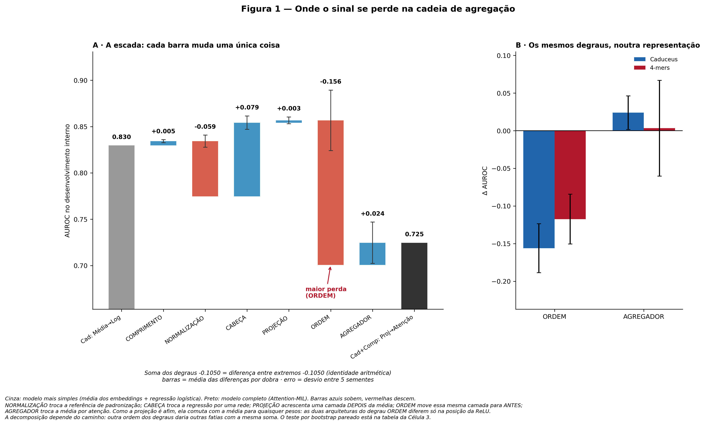
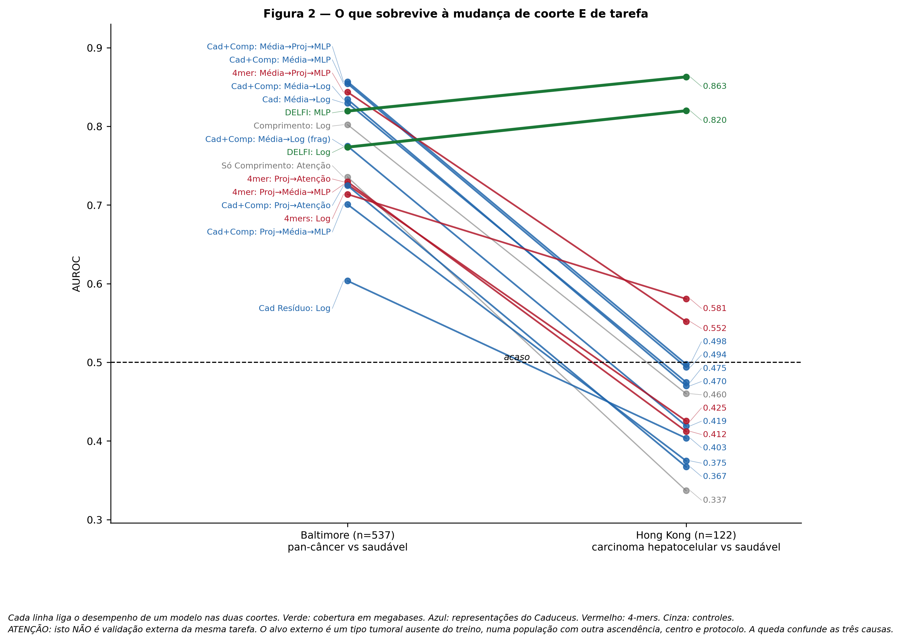
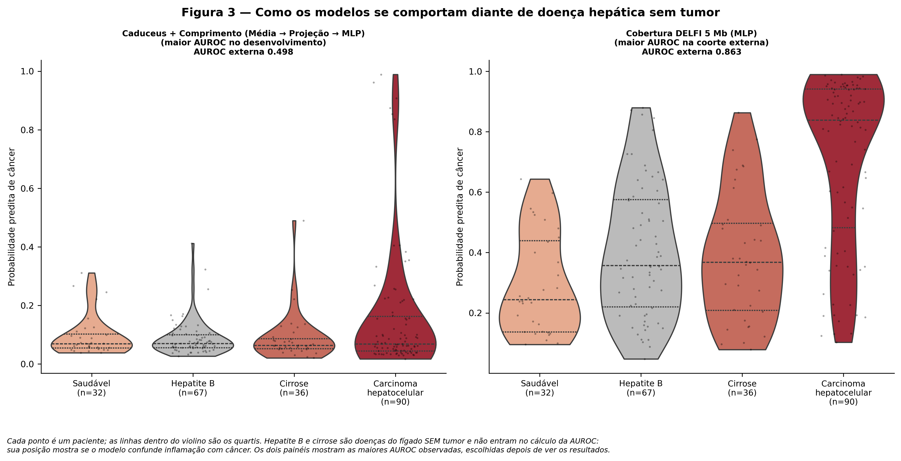
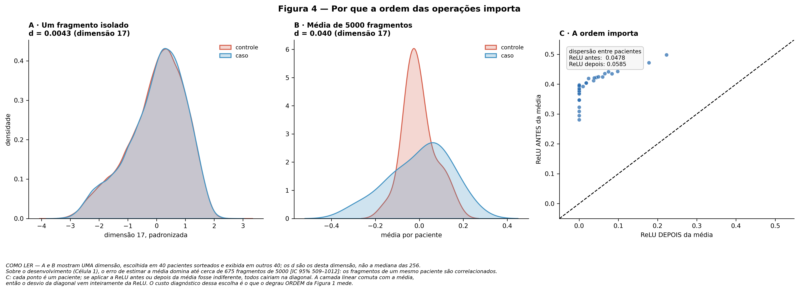

# FragmentomicsBenchmark

Auditoria metodológica sobre a agregação de fragmentos de cfDNA para detecção oncológica, avaliando modelos de fundação genômica e arquiteturas *Attention-MIL*. Este repositório contém o código, os dados tabulares e as representações visuais geradas no protocolo de validação cruzada (25 execuções independentes).

---

## 1. Análise Visual

### Figura 1: Decomposição da Arquitetura

A métrica AUROC avalia a capacidade de distinguir casos de câncer de controles.
* **Painel A (Simples vs. Complexo):** O modelo elementar (média + regressão logística) atinge AUROC 0,830. O modelo estruturado (*Attention-MIL* + codificador genômico) recua para 0,725.
* **Cascata de Etapas:** Cada barra altera um parâmetro.
    * COMPRIMENTO (+0,005): O tamanho da molécula traz ganho marginal.
    * NORMALIZAÇÃO (-0,059): A padronização por fragmento altera a escala.
    * CABEÇA (+0,079): A rede neural multicamada recupera desempenho.
    * PROJEÇÃO (+0,003): A função matemática após a média mantém o resultado.
    * ORDEM (-0,156): A mudança da função (ReLU) para antes da média gera a maior perda. A ReLU zera valores negativos e distorce o ruído estocástico antes que a média o anule.
    * AGREGADOR (+0,024): A atenção aprendida não identifica moléculas tumorais.
* **Painel B (Confirmação Estrutural):** A substituição do modelo por contagens (4-mers) repete a queda na etapa ORDEM (-0,117). O erro deriva da ordem matemática, não do codificador.

---

### Figura 2: Transferência de Coorte

O eixo horizontal vai da coorte de treino (Baltimore: pan-câncer, ocidentais) para a externa (Hong Kong: carcinoma hepatocelular, asiáticos). A linha em 0,5 demarca o acaso.
* **DELFI (Verde):** A quantificação em 5 Mb resiste à transição populacional. O classificador vai de 0,819 para 0,863.
* **Caduceus (Azul):** O modelo genômico desce para 0,498 (acaso). A representação por sequência memoriza particularidades locais e falha na transferência.
* **4-mers (Vermelho):** O comportamento repete o *Caduceus* (queda de 0,71–0,84 para 0,41–0,58), o que restringe a falha à leitura de sequência de base.
* **Comprimento (Cinza):** A métrica cai devido a variações de protocolo entre laboratórios.

---

### Figura 3: Separação de Grupos Clínicos

Avaliação da distinção entre câncer de fígado e inflamações (Hepatite B e Cirrose). O eixo vertical mede a probabilidade de câncer.
* **Caduceus (Painel Esquerdo):** O modelo genômico apresenta AUROC 0,498 na coorte externa. As distribuições colapsam na base (probabilidade < 0,1) tanto para casos quanto para controles.
* **DELFI (Painel Direito):** A cobertura em 5 Mb (AUROC 0,863) separa os grupos em um gradiente: controles na base, inflamações na faixa intermediária e câncer no topo (0,8 a 1,0).

---

### Figura 4: Mecanismo de Agregação

A figura explica a dependência da ordem das operações no regime de sinal fraco.
* **Painel A (Fragmento Isolado):** A distribuição da característica em moléculas únicas sobrepõe casos e controles (d = 0,0043). O sinal por molécula é ruído estocástico.
* **Painel B (Média da Amostra):** A média de 5.000 fragmentos separa os grupos (d = 0,040). A agregação cancela o ruído simétrico e isola o sinal.
* **Painel C (Ordem das Operações):** O eixo x aplica a ReLU após a média; o eixo y, antes. O desvio da diagonal (y = x) resulta unicamente da ReLU. A aplicação prévia corta valores negativos, quebra a simetria do ruído e impede seu cancelamento pela média.

---

## 2. Dados Tabulares (.csv)

### 2.1. `escada.csv` — Decomposição Incremental da Arquitetura

| Etapa | O que muda | $\Delta$ por dobra | $\pm$ DP | Escore agrupado [IC 95%] | Sinal (negativos) |
| :--- | :--- | :---: | :---: | :---: | :---: |
| **COMPRIMENTO** | Adiciona o tamanho físico da molécula | +0,005 | 0,002 | +0,005 [+0,000, +0,009] | 1/25 |
| **NORMALIZAÇÃO** | Padronização por paciente $\rightarrow$ por fragmento | -0,059 | 0,007 | -0,065 [-0,097, -0,034] | 22/25 |
| **CABEÇA** | Regressão logística $\rightarrow$ rede neural profunda | +0,079 | 0,007 | +0,081 [+0,055, +0,109] | 0/25 |
| **PROJEÇÃO** | Projeção não linear (ReLU) **depois** da média | +0,003 | 0,004 | +0,008 [+0,001, +0,014] | 10/25 |
| **ORDEM** | Move a mesma projeção (ReLU) para **antes** da média | **-0,156** | 0,033 | **-0,129 [-0,164, -0,097]** | **25/25** |
| **AGREGADOR** | Média aritmética $\rightarrow$ atenção aprendida | +0,024 | 0,022 | -0,050 [-0,096, -0,003] | 10/25 |

**Análise:** A etapa ORDEM concentra a maior perda (-0,156 de AUROC). A aplicação de transformações não lineares (ReLU) em moléculas isoladas colapsa o desempenho em 100% das execuções. A substituição da média por atenção aprendida (AGREGADOR) não recupera o sinal biológico.

---

### 2.2. `desempenho_interno.csv` — Desempenho no Desenvolvimento

| Braço Experimental | AUROC (média) | DP sementes | AUROC ensemble | Concordância |
| :--- | :---: | :---: | :---: | :---: |
| Caduceus + Comprimento (Média $\rightarrow$ Projeção $\rightarrow$ MLP) | **0,857** | 0,009 | 0,865 | 0,925 |
| Caduceus + Comprimento (Média $\rightarrow$ MLP) | 0,854 | 0,008 | 0,857 | **0,959** |
| Caduceus (Média $\rightarrow$ Logística) | 0,830 | 0,008 | 0,837 | 0,935 |
| Cobertura DELFI 5 Mb (MLP) | 0,819 | 0,018 | 0,829 | 0,790 |
| 4-mers + Comprimento (Projeção $\rightarrow$ Atenção MIL) | 0,729 | 0,033 | 0,662 | 0,197 |
| Caduceus + Comprimento (Projeção $\rightarrow$ Atenção MIL) | 0,725 | 0,033 | 0,687 | 0,178 |
| Caduceus + Comprimento (Projeção $\rightarrow$ Média $\rightarrow$ MLP) | 0,701 | 0,029 | 0,736 | 0,195 |

**Análise:** Modelos que calculam a média antes de operações não lineares alcançam AUROC acima de 0,83 e mantêm concordância superior a 0,92 entre repetições. Modelos que projetam fragmentos isolados ou utilizam atenção caem para ~0,70 e perdem a reprodutibilidade (concordância em torno de 0,18–0,24).

---

### 2.3. `desempenho_externo.csv` — Generalização em Coorte Externa

| Braço Experimental | AUROC Externa | DP sementes | IC 95% [inf, sup] | AUROC Interna | Variação ($\Delta$) |
| :--- | :---: | :---: | :---: | :---: | :---: |
| **Cobertura DELFI 5 Mb (MLP)** | **0,863** | 0,011 | [0,792, 0,922] | 0,819 | **+0,043** |
| Caduceus + Comprimento (Média $\rightarrow$ Projeção $\rightarrow$ MLP) | 0,498 | 0,021 | [0,395, 0,601] | 0,857 | -0,359 |
| Caduceus (Média $\rightarrow$ Logística) | 0,475 | 0,009 | [0,372, 0,585] | 0,830 | -0,355 |
| Caduceus + Comprimento (Projeção $\rightarrow$ Atenção MIL) | 0,367 | 0,032 | [0,268, 0,463] | 0,725 | -0,358 |
| Somente Comprimento (Atenção MIL) | 0,337 | 0,002 | [0,241, 0,427] | 0,736 | -0,399 |

**Análise:** Redes profundas baseadas em sequência fina sofrem colapso (AUROC 0,498, nível do acaso) ao mudar de população. A contagem macroscópica em blocos de 5 Mb (DELFI) sobrevive à transferência e eleva o desempenho (+0,043).

---

### 2.4. `replicacao_degraus.csv` — Verificação com 4-mers

| Etapa | Caduceus ($\Delta \pm$ DP) | 4-mers ($\Delta \pm$ DP) | IC 95% 4-mers | Negativos (4-mers) | Mesmo sinal? |
| :--- | :---: | :---: | :---: | :---: | :---: |
| **ORDEM** | -0,156 $\pm$ 0,033 | -0,117 $\pm$ 0,033 | [-0,113, -0,049] | 24/25 | **Sim** |
| **AGREGADOR** | +0,024 $\pm$ 0,022 | +0,003 $\pm$ 0,064 | [-0,154, -0,065] | 13/25 | **Sim** |

**Análise:** A perda associada à inversão da ordem das operações repete-se com a mesma magnitude e direção utilizando contagens de 4-mers. O defeito reside na estrutura matemática de agregação, e não no modelo de linguagem genômica.

---

### 2.5. `artefato_de_coorte.csv` — Separação entre Controles Saudáveis

| Representação de Entrada | Dimensões | $k=1$ | $k=2$ | $k=5$ | $k=10$ | $k$ para AUROC $\ge 0,95$ |
| :--- | :---: | :---: | :---: | :---: | :---: | :---: |
| **Cobertura DELFI 5 Mb** | 1.614 | 1,000 | 1,000 | 1,000 | 1,000 | **1** |
| **Ocupação de Promotores** | 39.614 | 0,543 | 0,558 | 0,614 | 0,624 | **>25** |
| **Composição de 4-mers** | 256 | 0,780 | 1,000 | 1,000 | 1,000 | **2** |
| **Embedding do Caduceus** | 256 | 0,824 | 0,990 | 0,999 | 1,000 | **2** |

**Análise:** Modelos de resolução de base (*Caduceus* e 4-mers) separam controles saudáveis americanos de asiáticos utilizando apenas duas direções matemáticas (AUROC 0,990). O sistema codifica as diferenças técnicas e de ancestralidade em vez de focar na assinatura tumoral.

---

### 2.6. `diagnostico_atencao.csv` — Concentração dos Pesos do Attention-MIL

| Braço Experimental | $N_{\text{efetivo}}$ | Fração da bolsa | Correlação com Comprimento |
| :--- | :---: | :---: | :---: |
| Caduceus + Comprimento (Projeção $\rightarrow$ Atenção MIL) | **4.781,9** | **95,6%** | 0,146 |
| 4-mers + Comprimento (Projeção $\rightarrow$ Atenção MIL) | **4.802,7** | **96,1%** | 0,060 |
| Somente Comprimento (Atenção MIL) | 4.224,5 | 84,5% | 0,810 |

**Análise:** O mecanismo de atenção distribui pesos por mais de 95% da bolsa (de um total de 5.000 fragmentos). Na presença de ruído dominante no nível do fragmento, a rede falha em isolar instâncias raras e atua como uma média aritmética dispersa.

---

### 2.7. `ponto_de_operacao.csv` — Simulação de Limiar Clínico

| Braço Experimental | Especificidade Externa | Sensibilidade Externa |
| :--- | :---: | :---: |
| **Cobertura DELFI 5 Mb (MLP)** | **1,000** | **61,1%** |
| Caduceus + Comprimento (Projeção $\rightarrow$ Atenção MIL) | 1,000 | 5,6% |
| Caduceus + Comprimento (Média $\rightarrow$ Projeção $\rightarrow$ MLP) | 1,000 | 5,6% |
| Caduceus (Média $\rightarrow$ Logística) | 1,000 | 3,3% |
| Composição de 4-mers (Média $\rightarrow$ Logística) | 1,000 | 0,0% |

**Análise:** Fixada a especificidade em 95% no conjunto de desenvolvimento, o modelo macroscópico DELFI detecta 61,1% dos doentes oncológicos na coorte externa. Os modelos profundos de resolução de base detectam no máximo 5,6%.

---

### 2.8. `controles_otimizacao.csv` — Estabilidade do Treinamento

| Braço Neural | Épocas Médias | Pico Parada Suave | Execuções Abaixo do Limiar (Falhas) |
| :--- | :---: | :---: | :---: |
| Caduceus + Comp. (Proj. $\rightarrow$ Média $\rightarrow$ MLP) | 22,6 | 0,700 | **6** |
| 4-mers + Comp. (Proj. $\rightarrow$ Média $\rightarrow$ MLP) | 25,1 | 0,751 | **4** |
| Caduceus + Comp. (Proj. $\rightarrow$ Atenção MIL) | 19,2 | 0,747 | **3** |
| 4-mers + Comp. (Proj. $\rightarrow$ Atenção MIL) | 17,4 | 0,744 | **3** |
| Caduceus + Comp. (Média $\rightarrow$ MLP) | 57,1 | 0,853 | **0** |
| Caduceus + Comp. (Média $\rightarrow$ Proj. $\rightarrow$ MLP) | 46,6 | 0,854 | **0** |

**Análise:** De 17 falhas totais de treinamento documentadas (AUROC < 0,60 na validação), 16 ocorreram em arquiteturas que processam fragmento a fragmento antes da média. Nenhuma falha foi registrada nos modelos que aplicam a média previamente, confirmando a instabilidade gerada pelo regime de fragmento único.

---

### 2.9. `auroc_por_semente.csv` — Dispersão por Réplica

| Semente | DELFI (MLP) | Caduceus (Média $\rightarrow$ Proj. $\rightarrow$ MLP) | Caduceus (Proj. $\rightarrow$ Atenção MIL) |
| :---: | :---: | :---: | :---: |
| `semente_1807` | 0,798 | 0,865 | 0,770 |
| `semente_2024` | 0,825 | 0,861 | 0,733 |
| `semente_3141` | 0,828 | 0,868 | 0,691 |
| `semente_5926` | 0,842 | 0,851 | 0,689 |
| `semente_8979` | 0,802 | 0,859 | 0,734 |
| **Média $\pm$ DP** | **0,819 $\pm$ 0,018** | **0,857 $\pm$ 0,009** | **0,725 $\pm$ 0,033** |

**Análise:** Os modelos que calculam a média previamente mantêm variação contida em diferentes partições (DP de 0,009). A arquitetura com atenção exibe instabilidade severa, variando entre 0,689 e 0,770 (DP de 0,033) de acordo com o ponto inicial de otimização, inviabilizando a avaliação baseada em semente única.
